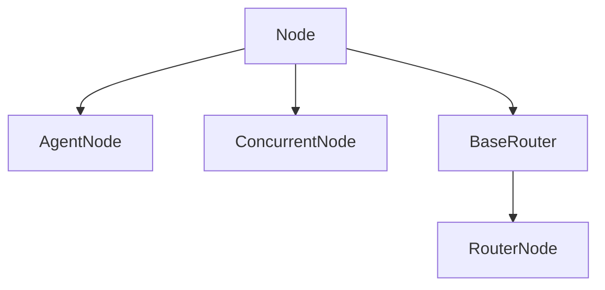

# Overview

> Build your first GenAI workflow - a customer care automation system

This quickstart shows the Launchpad in action through a customer care example. You follow the steps end‑to‑end without writing new code, and you see how the same steps map to your own client workflows.

## General Development Flow

<Steps>
  <Step title="Define an event schema">
    Create a Pydantic model that defines the structure of your incoming data
  </Step>

  <Step title="Implement the endpoint">
    Build a FastAPI endpoint that receives events and triggers workflow processing
  </Step>

  <Step title="Build the workflow">
    Design and implement the workflow logic using various node types
  </Step>
</Steps>

## What We're Building

In this quickstart, we'll explore a customer care automation system that:

<Steps>
  <Step title="Analyzes Tickets">
    Processes incoming support tickets through intelligent analysis
  </Step>

  <Step title="Filters Spam">
    Detects and filters out spam messages automatically
  </Step>

  <Step title="Routes Intelligently">
    Makes smart routing decisions based on ticket content
  </Step>

  <Step title="Generates Responses">
    Creates appropriate AI-powered responses to customer queries
  </Step>
</Steps>

## Getting Started

To run the example, check out the `quickstart` branch. It includes a fully implemented workflow so you can observe the event flow, background processing, and results without additional setup.

```bash
git checkout quickstart
```

## What You'll Learn

By the end, you understand how to structure event schemas, create API endpoints that trigger workflows, build multi‑node pipelines, integrate AI models for processing, test locally and end‑to‑end, and monitor results in Supabase Studio.


# Define Your Schema

> Create a Pydantic schema to define your data structure

You start every workflow by defining the structure of the incoming event. A Pydantic schema becomes the single source of truth for validation, documentation, and serialization.

## Why Schemas Matter

Schemas give you automatic type validation, inline documentation through field descriptions, and straightforward JSON serialization, so you can accept reliable inputs and publish clear API docs without extra boilerplate.

## Customer Care Event Schema

For our customer care use case, we've defined the following schema:

```python
from datetime import datetime, timezone
from pydantic import BaseModel, Field
from uuid import UUID, uuid4


class CustomerCareEventSchema(BaseModel):
    ticket_id: UUID = Field(
        default_factory=uuid4, 
        description="Unique identifier for the ticket"
    )
    timestamp: datetime = Field(
        default_factory=lambda: datetime.now(timezone.utc),
        description="Time when the ticket was created",
    )
    from_email: str = Field(
        ..., 
        description="Email address of the sender"
    )
    to_email: str = Field(
        ..., 
        description="Email address of the recipient"
    )
    sender: str = Field(
        ..., 
        description="Name or identifier of the sender"
    )
    subject: str = Field(
        ..., 
        description="Subject of the ticket"
    )
    body: str = Field(
        ..., 
        description="The body of the ticket"
    )
```

## Schema Components Explained

### Automatic ID Generation

The `ticket_id` field uses `default_factory=uuid4` to automatically generate a unique identifier for each ticket when created.

### Timestamp Management

The `timestamp` field automatically captures the creation time in UTC, ensuring consistent time tracking across different timezones.

### Required Fields

Fields marked with `...` (ellipsis) are required and must be provided when creating an event instance.

### Field Descriptions

Each field includes a description that serves as inline documentation and helps with API documentation generation.

## File Location

Place schemas in `app/schemas` to keep data models discoverable and consistent across projects.

# Workflow Definition

> Create the workflow structure and register it in the system

Now we'll define an empty Workflow schema that serves as the container for your workflow logic. This is where you'll specify which event schema to use and how nodes connect together.

## Creating the Workflow Class

Create a new file under `app/workflows` directory. For the quickstart, we've created `app/workflows/customer_care_workflow.py`:

```python
from core.schema import WorkflowSchema
from core.workflow import Workflow
from schemas.customer_care_schema import CustomerCareEventSchema


class CustomerCareWorkflow(Workflow):
    workflow_schema = WorkflowSchema(
        description="",
        event_schema=CustomerCareEventSchema,
        start=,
        nodes=[],
    )
```

At this point, the workflow is just a skeleton. We'll add the actual node implementations and connections in the next steps.

## Workflow Schema Components

* **description**: A human-readable description of what the workflow does
* **event\_schema**: The Pydantic schema that defines the expected input data structure
* **start**: The name of the first node to execute in the workflow
* **nodes**: List of all nodes that will be part of this workflow

## Registering the Workflow

To make your workflow available to the system, you need to register it in the `WorkflowRegistry`.

Add a new entry to `app/workflows/workflow_registry.py`:

```python
from enum import Enum

from workflows.customer_care_workflow import CustomerCareWorkflow


class WorkflowRegistry(Enum):
    CUSTOMER_CARE = CustomerCareWorkflow
```

**Important**: The workflow registry enum name (e.g., `CUSTOMER_CARE`) will be used to reference this workflow throughout the application. Choose a descriptive name that clearly indicates the workflow's purpose.

## Why Use a Registry?

The `WorkflowRegistry` enum provides several benefits:

### Centralized Management

All workflows are registered in one place, making it easy to see what workflows are available in your system.

### Type Safety

Using an enum ensures you can only reference workflows that actually exist, preventing typos and runtime errors.

### Easy Discovery

IDEs can autocomplete workflow names, making development faster and reducing errors.

### Dynamic Loading

The system can dynamically load and execute workflows based on the registry entry.

**Tip**: Keep your workflow names consistent with their purpose. For example, use `CUSTOMER_CARE` for customer support workflows, `ORDER_PROCESSING` for e-commerce workflows, etc.

# Create API Endpoint

> Build a FastAPI endpoint to receive events and trigger workflows

You now set up an endpoint to receive events. The endpoint validates input, persists the event, and enqueues processing.

## Endpoint Implementation

The implementation below creates a simple POST endpoint without authentication (for demonstration purposes):

```python
from http import HTTPStatus

import json
from fastapi import APIRouter, Depends
from sqlalchemy.orm import Session
from starlette.responses import Response

from celery_worker.config import celery_app
from database.event import Event
from database.repository import GenericRepository
from database.session import db_session
from schemas.customer_care_schema import CustomerCareEventSchema
from workflows.workflow_registry import WorkflowRegistry

router = APIRouter()


@router.post("/", dependencies=[])
def handle_event(
    data: CustomerCareEventSchema,
    session: Session = Depends(db_session),
) -> Response:
    # Store event in database
    repository = GenericRepository(
        session=session,
        model=Event,
    )
    raw_event = data.model_dump(mode="json")
    event = Event(data=raw_event, workflow_type=get_workflow_type())
    repository.create(obj=event)

    # Queue processing task
    task_id = celery_app.send_task(
        "process_incoming_event",
        args=[str(event.id)],
    )

    # Return acceptance response
    return Response(
        content=json.dumps({"message": f"process_incoming_event started `{task_id}` "}),
        status_code=HTTPStatus.ACCEPTED,
    )


def get_workflow_type() -> str:
    return WorkflowRegistry.CUSTOMER_CARE.name
```

## Key Actions Performed

<Steps>
  <Step title="Data validation">
    FastAPI validates the request body against `CustomerCareEventSchema`. If validation fails, the API returns a 422 response with details.
  </Step>

  <Step title="Database storage">
    The event is stored with raw JSON, the workflow type from the registry, a generated ID, and timestamps.
  </Step>

  <Step title="Task queuing">
    A Celery task named `process_incoming_event` is queued with the event ID and returns a task ID for tracking.
  </Step>

  <Step title="Response">
    The endpoint returns HTTP 202 (Accepted) to indicate asynchronous processing.
  </Step>
</Steps>

## Understanding the Components

* **GenericRepository**: Provides database operations (create, read, update, delete) for any model
* **db\_session**: FastAPI dependency that provides a database session for the request
* **celery\_app**: The Celery application instance for queuing background tasks
* **WorkflowRegistry**: Enum containing all registered workflows in the system

## Response Status Code

The endpoint returns **HTTP 202 (Accepted)** rather than 200 (OK) because the workflow processing happens asynchronously, the client is informed that the request is queued, and the actual processing will happen in the background.

## Security Considerations

**Security Note**: This example endpoint has no authentication for simplicity. In production, you should add authentication middleware, implement rate limiting, validate API keys or JWT tokens, and use HTTPS for secure communication.

# Workflow Implementation

> Build the complete customer care workflow with AI-powered nodes

Now you implement the workflow steps. Each step is a **node**. This example demonstrates reusable patterns you can apply across client projects.

## Workflow Steps

<Steps>
  <Step title="Analyze ticket contents">
    Run three concurrent analyses:

    * Determine ticket intent
    * Check for spam
    * Validate information sufficiency
  </Step>

  <Step title="Route based on analysis">
    Make intelligent routing decisions:

    * Close spam tickets
    * Escalate urgent issues
    * Process specific requests (invoices, refunds)
    * Generate responses for general queries
  </Step>

  <Step title="Take action">
    Execute the appropriate action based on routing decision
  </Step>
</Steps>

All nodes are located in the folder: `app/workflows/customer_care_workflow_nodes`.

## Step 1: Concurrent Analysis

### AnalyzeTicketNode

Since our three analysis operations are independent, we use `ConcurrentNode` to run them simultaneously:

```python
class AnalyzeTicketNode(ConcurrentNode):
    async def process(self, task_context: TaskContext) -> TaskContext:
        await self.execute_nodes_concurrently(task_context)
        return task_context
```

**Tip**: Use concurrency when independent AI calls reduce total processing time.

### DetermineTicketIntentNode

This `AgentNode` uses AI to classify the ticket intent:

```python
class CustomerIntent(str, Enum):
    GENERAL_QUESTION = "general/question"
    PRODUCT_QUESTION = "product/question"
    BILLING_INVOICE = "billing/invoice"
    REFUND_REQUEST = "refund/request"

    @property
    def escalate(self) -> bool:
        return self in {self.REFUND_REQUEST}


class DetermineTicketIntentNode(AgentNode):
    class OutputType(AgentNode.OutputType):
        reasoning: str = Field(
            description="Explain your reasoning for the intent classification"
        )
        intent: CustomerIntent
        confidence: float = Field(
            ge=0, le=1, description="Confidence score for the intent"
        )
        escalate: bool = Field(
            description="Flag to indicate if the ticket needs escalation"
        )

    class DepsType(AgentNode.DepsType):
        from_email: str = Field(..., description="Email address of the sender")
        sender: str = Field(..., description="Name or identifier of the sender")
        subject: str = Field(..., description="Subject of the ticket")
        body: str = Field(..., description="The body of the ticket")

    def get_agent_config(self) -> AgentConfig:
        return AgentConfig(
            system_prompt=PromptManager().get_prompt("ticket_analysis"),
            output_type=self.OutputType,
            deps_type=self.DepsType,
            model_provider=ModelProvider.ANTHROPIC,
            model_name="claude-3-7-sonnet-latest",
        )

    async def process(self, task_context: TaskContext) -> TaskContext:
        event: CustomerCareEventSchema = task_context.event
        deps = self.DepsType(
            from_email=event.from_email,
            sender=event.sender,
            subject=event.subject,
            body=event.body,
        )

        @self.agent.system_prompt
        def add_ticket_context(
            ctx: RunContext[DetermineTicketIntentNode.DepsType],
        ) -> str:
            return deps.model_dump_json(indent=2)

        result = await self.agent.run(
            user_prompt=event.model_dump_json(indent=2),
        )
        self.save_output(result.output)
        return task_context
```

### FilterSpamNode

Detects spam messages using AI:

```python
class FilterSpamNode(AgentNode):
    class OutputType(AgentNode.OutputType):
        reasoning: str = Field(
            description="Explain your reasoning for spam detection"
        )
        confidence: float = Field(
            ge=0, le=1,
            description="Confidence score for the classification"
        )
        is_human: bool = Field(
            description="True if human-written, False if spam"
        )

    def get_agent_config(self) -> AgentConfig:
        return AgentConfig(
            system_prompt="You are a helpful assistant that filters messages...",
            output_type=self.OutputType,
            deps_type=None,
            model_provider=ModelProvider.ANTHROPIC,
            model_name="claude-3-7-sonnet-latest",
        )

    async def process(self, task_context: TaskContext) -> TaskContext:
        event: CustomerCareEventSchema = task_context.event
        result = await self.agent.run(
            user_prompt=event.model_dump_json(),
        )
        self.save_output(result.output)
        return task_context
```

### ValidateTicketNode

Verifies if the ticket contains actionable information:

```python
class ValidateTicketNode(AgentNode):
    class OutputType(AgentNode.OutputType):
        reasoning: str = Field(
            description="Reasoning for actionability determination"
        )
        confidence: float = Field(
            ge=0, le=1,
            description="Confidence score"
        )
        is_actionable: bool = Field(
            description="True if ticket is actionable"
        )

    def get_agent_config(self) -> AgentConfig:
        return AgentConfig(
            system_prompt="Review tickets for actionable information...",
            output_type=self.OutputType,
            deps_type=None,
            model_provider=ModelProvider.ANTHROPIC,
            model_name="claude-3-7-sonnet-latest",
        )

    async def process(self, task_context: TaskContext) -> TaskContext:
        event: CustomerCareEventSchema = task_context.event
        result = await self.agent.run(
            user_prompt=event.model_dump_json(),
        )
        self.save_output(result.output)
        return task_context
```

## Step 2: Intelligent Routing

### TicketRouterNode

The router examines analysis results and selects the next action:

```python
class TicketRouterNode(BaseRouter):
    def __init__(self):
        self.routes = [
            CloseTicketRouter(),
            EscalationRouter(),
            InvoiceRouter(),
        ]
        self.fallback = GenerateResponseNode()
```

* **CloseTicketRouter**: Closes spam tickets automatically when confidence > 0.8
* **EscalationRouter**: Escalates urgent or sensitive issues to human agents
* **InvoiceRouter**: Routes billing-related requests to invoice processing

### Router Implementation

```python
class CloseTicketRouter(RouterNode):
    def determine_next_node(self, task_context: TaskContext) -> Optional[Node]:
        filter_spam_node: FilterSpamNode.OutputType = self.get_output(FilterSpamNode)
        if not filter_spam_node.is_human and filter_spam_node.confidence > 0.8:
            return CloseTicketNode()
        return None

class EscalationRouter(RouterNode):
    def determine_next_node(self, task_context: TaskContext) -> Optional[Node]:
        intent_node: DetermineTicketIntentNode.OutputType = self.get_output(
            DetermineTicketIntentNode
        )
        if intent_node.intent.escalate or intent_node.escalate:
            return EscalateTicketNode()
        return None

class InvoiceRouter(RouterNode):
    def determine_next_node(self, task_context: TaskContext) -> Optional[Node]:
        intent_node: DetermineTicketIntentNode.OutputType = self.get_output(
            DetermineTicketIntentNode
        )
        if intent_node.intent == CustomerIntent.BILLING_INVOICE:
            return ProcessInvoiceNode()
        return None
```

## Step 3: Action Nodes

### GenerateResponseNode

Creates AI-powered responses for customer queries:

```python
class GenerateResponseNode(AgentNode):
    class OutputType(AgentNode.OutputType):
        reasoning: str = Field(description="The reasoning for the response")
        response: str = Field(description="The response to the ticket")
        confidence: float = Field(
            ge=0, le=1, 
            description="Confidence score for response quality"
        )

    def get_agent_config(self) -> AgentConfig:
        return AgentConfig(
            system_prompt=PromptManager().get_prompt("customer_ticket_response"),
            output_type=self.OutputType,
            deps_type=None,
            model_provider=ModelProvider.AZURE_OPENAI,
            model_name="gpt-4o",
        )

    async def process(self, task_context: TaskContext) -> TaskContext:
        event: CustomerCareEventSchema = task_context.event
        result = await self.agent.run(
            user_prompt=event.model_dump_json(),
        )
        self.save_output(result.output)
        return task_context
```

### SendReplyNode

Delivers the generated response:

```python
class SendReplyNode(Node):
    async def process(self, task_context: TaskContext) -> TaskContext:
        logging.info("Sending reply:")
        output: GenerateResponseNode.OutputType = self.get_output(GenerateResponseNode)
        logging.info(output.response)
        return task_context
```

## Complete Workflow Schema

```python
class CustomerCareWorkflow(Workflow):
    workflow_schema = WorkflowSchema(
        description="Customer care ticket processing workflow",
        event_schema=CustomerCareEventSchema,
        start=AnalyzeTicketNode,
        nodes=[
            NodeConfig(
                node=AnalyzeTicketNode,
                connections=[TicketRouterNode],
                description="Analyze ticket in parallel",
                parallel_nodes=[
                    DetermineTicketIntentNode,
                    FilterSpamNode,
                    ValidateTicketNode,
                ],
            ),
            NodeConfig(
                node=TicketRouterNode,
                connections=[
                    CloseTicketNode,
                    EscalateTicketNode,
                    GenerateResponseNode,
                    ProcessInvoiceNode,
                ],
                description="Route based on analysis",
                is_router=True,
            ),
            NodeConfig(
                node=GenerateResponseNode,
                connections=[SendReplyNode],
                description="Generate AI response",
            ),
        ],
    )
```

# Testing Your Workflow

> Test workflows locally before deployment

Test locally first. The workflow playground lets you validate logic without running the full API stack.

## Local Testing Setup

Use pre-defined test events in `requests/events` and the playground script at `playground/workflow_playground.py` to execute workflows directly.

## Running a Test

To test your workflow locally, use the following simple pattern:

```python
event = EventFactory.create_event(event_key="product")
workflow = CustomerCareWorkflow()
result = workflow.run(event)
```

The `event_key` parameter corresponds to a JSON file name in the `requests/events` directory. For example, `event_key="product"` loads `requests/events/product.json`.

## Benefits of Local Testing

### Immediate Feedback

You see results instantly without waiting for async processing or checking databases.

### Easy Debugging

Add breakpoints and step through your workflow logic in your IDE.

### No Dependencies

You can test without running Docker containers, Celery workers, or databases.

### Rapid Iteration

Modify and test workflow logic quickly without restarting services.

## Creating Custom Test Events

To add your own test events:

<Steps>
  <Step title="Create JSON file">
    Add a new JSON file to `requests/events/` with your test data
  </Step>

  <Step title="Match schema">
    Ensure the JSON structure matches your event schema exactly
  </Step>

  <Step title="Reference by name">
    Use the filename (without .json) as the `event_key` in EventFactory
  </Step>
</Steps>

# End-to-End Testing

> Test the complete workflow with API, database, and background processing

After local validation, test the full system: API endpoint, database persistence, and asynchronous processing. This confirms the components work together as expected.

## Test Script Overview

GenAI Launchpad includes `requests/send_event.py` for end-to-end testing. This script:

<Steps>
  <Step title="Loads test data">
    Reads JSON payloads from the `requests/events` directory
  </Step>

  <Step title="Sends HTTP request">
    Posts the data to your API endpoint
  </Step>

  <Step title="Validates response">
    Confirms the API returns HTTP 202 (Accepted)
  </Step>

  <Step title="Triggers background processing">
    Celery workers process the workflow asynchronously
  </Step>
</Steps>

## Running the Test

Here is the test script implementation:

```python
def load_event(event_file: str):
    with open(EVENTS_DIR / event_file, "r") as f:
        return json.load(f)


def send_event(event_file: str):
    payload = load_event(event_file)
    response = requests.post(BASE_URL, json=payload)

    print(f"Testing {event_file}:")
    print(f"Status Code: {response.status_code}")
    print(f"Response: {response.text}")

    assert response.status_code == 202


if __name__ == "__main__":
    send_event(event_file="invoice.json")
```

The script expects an HTTP 202 response, indicating the request was accepted for asynchronous processing.

## Prerequisites

Before running end-to-end tests, ensure:

* ✔ **Docker Running**: All containers must be up and running via `docker ps`
* ✔ **API Available**: The FastAPI service should be accessible at your configured port
* ✔ **Celery Workers**: Background workers must be running to process tasks
* ✔ **Database Ready**: PostgreSQL/Supabase must be initialized with migrations applied

## Monitoring Results in Supabase Studio

To view the workflow execution results:

<Steps>
  <Step title="Access Supabase Studio">
    Navigate to [http://localhost:8000](http://localhost:8000) in your browser
  </Step>

  <Step title="Authenticate">
    Enter the credentials:

    * **Username**: `supabase`
    * **Password**: `supabase`
  </Step>

  <Step title="View Events Table">
    1. Click on the **Table Editor** tab
    2. Select the `events` table
    3. View your processed events and their status
  </Step>
</Steps>

## Troubleshooting

If events are not processing, check Docker containers (`docker ps`), Celery worker logs, API availability (try a curl request), and that database migrations are applied.

# CORE PACKAGES Overview

> Learn about the core package that provides a flexible DAG-based workflow system for processing tasks through interconnected nodes.

<Info>
  The `core` package provides a flexible framework for defining and executing workflows. It implements a DAG‑based system where tasks move through processing nodes, and each node updates a shared task context.
</Info>

## Package Structure

The `core` package consists of the following components:

**Core Components:**

* **Nodes** - Node implementations for workflow processing
* **Schema** - Schema definitions for workflow configuration
* **Task Context** - Task context definitions for state management
* **Validation** - Workflow validation utilities
* **Workflow** - Workflow orchestration and execution

```
app/core/
├── nodes/               # Node implementations for workflow processing
├── schema.py            # Schema definitions for workflow configuration
├── task.py              # Task context definitions
├── validate.py          # Workflow validation utilities
└── workflow.py          # Workflow orchestration
```

## Key Features

**Key Features:**

* **Workflow orchestration**: Define processing pipelines with interconnected nodes
* **Task context management**: Centralized state enables data flow between nodes
* **Node-based architecture**: Modular, reusable processing components
* **Schema validation**: Built‑in checks ensure valid DAGs and clear structure

# Workflow Orchestration

> Understand the DAG-based workflow system that manages node execution and data flow through directed processing pipelines.

The workflow system is built around the concept of a directed acyclic graph (DAG) where nodes represent processing steps and edges represent the flow of data between them. The `Workflow` class in `workflow.py` serves as the orchestrator, managing the execution flow and passing the task context between nodes.

## Workflow Class

The foundation of the workflow system is the abstract `Workflow` class:

```python
class Workflow(ABC):
    """Abstract base class for defining processing workflows.

    The Workflow class provides a framework for creating processing workflows
    with multiple nodes and routing logic. Each workflow must define its structure
    using a WorkflowSchema.
    """
```

**Key capabilities:**

* Abstract base class for concrete workflows
* Schema validation during initialization
* Node execution and routing management
* Task context passing between nodes

## Schema Definitions

The `schema.py` module defines the structure and configuration of workflows using Pydantic models.

### WorkflowSchema

```python
class WorkflowSchema(BaseModel):
    """Schema definition for a complete workflow.

    WorkflowSchema defines the overall structure of a processing workflow,
    including its entry point and all constituent nodes.
    """
```

**Key attributes:**

* `description`: Optional description of the workflow's purpose
* `event_schema`: Pydantic model for validating incoming events
* `start`: The entry point Node class for the workflow
* `nodes`: List of NodeConfig objects defining the workflow structure

**Benefits:**

* **Type Safety**: Pydantic models ensure type validation
* **Documentation**: Built-in schema documentation
* **Validation**: Automatic validation of workflow structure
* **IDE Support**: Full autocomplete and type checking

### NodeConfig

```python
class NodeConfig(BaseModel):
    """Configuration model for workflow nodes.

    NodeConfig defines the structure and behavior of a single node within
    a workflow, including its connections to other nodes and routing properties.
    """
```

**NodeConfig attributes:**

* `node`: The Node class to be instantiated
* `connections`: List of Node classes this node can connect to
* `is_router`: Flag indicating if this node performs routing logic
* `description`: Optional description of the node's purpose
* `concurrent_nodes`: Optional list of Node classes that can run concurrently

## Workflow Validation

The `validate.py` module provides validation logic for workflow schemas, ensuring they form valid directed acyclic graphs (DAGs) and have proper routing configurations.

**Validation Features:**

1. **DAG Validation** - Validates that the workflow forms a proper DAG with no cycles
2. **Reachability Check** - Ensures all nodes are reachable from the start node
3. **Router Validation** - Validates that only router nodes have multiple connections

## Workflow Example

Here's a complete example of a workflow implementation:

```python
from core.schema import WorkflowSchema, NodeConfig
from core.workflow import Workflow
from schemas.example_schema import ExampleEventSchema
from workflows.example_workflow_nodes.initial_node import InitialNode
from workflows.example_workflow_nodes.process_node import ProcessNode
from workflows.example_workflow_nodes.router_node import ExampleRouter
from workflows.example_workflow_nodes.success_node import SuccessNode
from workflows.example_workflow_nodes.error_node import ErrorNode

class ExampleWorkflow(Workflow):
    workflow_schema = WorkflowSchema(
        description="Example workflow for processing data",
        event_schema=ExampleEventSchema,
        start=InitialNode,
        nodes=[
            NodeConfig(
                node=InitialNode,
                connections=[ProcessNode],
                description="Initial processing of the event",
            ),
            NodeConfig(
                node=ProcessNode,
                connections=[ExampleRouter],
                description="Process the data",
            ),
            NodeConfig(
                node=ExampleRouter,
                connections=[SuccessNode, ErrorNode],
                is_router=True,
                description="Route based on processing results",
            ),
            NodeConfig(
                node=SuccessNode,
                connections=[],
                description="Handle successful processing",
            ),
            NodeConfig(
                node=ErrorNode,
                connections=[],
                description="Handle processing errors",
            ),
        ],
    )
```

This example demonstrates a typical workflow pattern: initial processing, data transformation, routing based on results, and terminal nodes for success and error handling.

# Task Context

> Learn how the TaskContext provides stateful data management throughout workflow execution, enabling seamless data sharing between nodes.

<Info>
  The task context is a stateful Pydantic model used throughout the workflow. It provides a single reference point accessible from any node, so relevant data can be stored and retrieved as needed.
</Info>

## TaskContext Class

The `TaskContext` class serves as the central data container for workflow execution:

```python
class TaskContext(BaseModel):
    """Context container for workflow task execution.

    TaskContext maintains the state and results of a workflow's execution,
    tracking the original event, intermediate node results, and additional
    metadata throughout the processing flow.

    Attributes:
        event: The original event that triggered the workflow
        nodes: Dictionary storing results and state from each node's execution
        metadata: Dictionary storing workflow-level metadata and configuration

    Example:
        context = TaskContext(
            event=incoming_event,
            nodes={"AnalyzeNode": {"score": 0.95}},
            metadata={"priority": "high"}
        )
    """

    event: Any
    nodes: Dict[str, Any] = Field(
        default_factory=dict,
        description="Stores results and state from each node's execution",
    )
    metadata: Dict[str, Any] = Field(
        default_factory=dict,
        description="Stores workflow-level metadata and configuration",
    )

    def update_node(self, node_name: str, **kwargs):
        self.nodes[node_name] = {**self.nodes.get(node_name, {}), **kwargs}
```

**TaskContext attributes:**

* **Event Data** - Stores the original triggering event
* **Node Results** - Maintains results from each node execution
* **Metadata** - Stores workflow-level configuration and metadata

## The Event Attribute

The `event` attribute in `TaskContext` serves as the main entry point for workflow input data. When a workflow is initialized, the provided event is parsed according to the `event_schema` specified within the `WorkflowSchema`.

This mechanism supports many event formats because each workflow defines its own event schema. You can run multiple workflows for different inputs without changing the shared workflow infrastructure.

**Example WorkflowSchema:**

```python
class PlaceholderWorkflow(Workflow):
    workflow_schema = WorkflowSchema(
        description="",
        event_schema=PlaceholderEventSchema,
        start=InitialNode,
        nodes=[
            NodeConfig(
                node=InitialNode,
                connections=[],
                description="",
                concurrent_nodes=[],
            ),
        ],
    )
```

## Type Hinting

By default, the `event` attribute of `TaskContext` has the type `Any`, which means you won't get autocomplete or type checking when accessing its fields or methods.

However, since each workflow defines its own `event_schema`, you already know the expected structure of `event` within that workflow.

To benefit from IDE features like autocomplete and static type checking, explicitly type the `event` attribute when retrieving it from the `TaskContext`. This makes your code more readable and helps catch errors earlier.

**Example:**

```python
event: PlaceholderEventSchema = task_context.event
```

**Implementation steps:**

1. **Define Event Schema** - Create a Pydantic model for your event structure
2. **Configure Workflow** - Set the event\_schema in your WorkflowSchema
3. **Type the Event** - Cast the event to your schema type in node processing
4. **Enjoy Type Safety** - Get full IDE support and compile-time error checking

## Best practices

* **Event schema design**: Use specific, well‑described field names
* **Node result storage**: Store results under the node class name for consistency
* **Metadata usage**: Keep workflow‑level configuration in metadata
* **Type safety**: Cast the event to your schema type in node processing

# Types of Nodes

> Explore the four primary node types that serve as building blocks for workflow processing steps, each designed for specific use cases.

## Overview

Nodes are the building blocks of workflow processing. There are four primary node types, each designed for a specific part of data processing or control.

**Primary Node Types:**

* **[Node](#base-node)** - Performs basic processing tasks with custom logic
* **[AgentNode](#agent-node)** - Handles processing using Large Language Models (LLM)
* **[ConcurrentNode](#concurrent-node)** - Executes multiple nodes concurrently for better performance
* **[BaseRouter](#router-node)** - Directs data flow using conditional routing logic

## Node Architecture

Each node type serves a distinct purpose in the workflow ecosystem:

**Node Categories:**

**Processing Nodes:**

* **Node**: Custom processing logic for any computational task
* **AgentNode**: LLM-powered processing for AI-driven operations

**Control Nodes:**

* **ConcurrentNode**: Parallel execution of independent operations
* **BaseRouter**: Conditional branching based on processing results

## When to Use Each Node Type

1. **Node for custom logic**: Data validation or computations without AI
2. **AgentNode for AI**: Natural language understanding and generation
3. **ConcurrentNode for parallelism**: Independent operations running simultaneously
4. **BaseRouter for conditional flow**: Branch based on results or business rules

## Node Hierarchy

All specialized node types inherit from the base `Node` class, ensuring a consistent interface while providing specialized functionality for different use cases.



## Design Principles

* **Single Responsibility** - Each node type has a clear, single responsibility aligned with its specific use case
* **Extensibility** - Abstract base classes allow for easy extension while maintaining consistent interfaces
* **Composability** - Nodes can be easily combined to create complex workflows leveraging each type's strengths
* **Consistency** - All nodes share common patterns for context management, error handling, and result storage

# Base Node

> Learn about the foundational Node class that all other node types inherit from, and how to implement custom processing logic.

The `Node` class is the foundation for all other node types. Each specialized node implements the `process()` method, which contains the step’s core logic.

Use `process()` to define how the node handles data during execution. This design keeps implementations consistent and extensible.

## Node Class

The base `Node` class provides the essential structure for all workflow processing steps:

```python
class Node(ABC):
    def save_output(self, output: BaseModel):
        self.task_context.nodes[self.node_name] = output

    def get_output(self, node_class: Type["Node"]) -> Optional[OutputType]:
        return self.task_context.nodes.get(node_class.__name__, None)

    @property
    def node_name(self) -> str:
        return self.__class__.__name__

    @abstractmethod
    async def process(self, task_context: TaskContext) -> TaskContext:
        pass
```

**Key features:**

* Abstract base class for a consistent interface
* Node name property uses the class name
* Abstract `process` method for subclasses
* Async support for non‑blocking operations

## Basic Implementation

Here is a simple example of a custom node:

```python
class ValidateInputNode(Node):
    async def process(self, task_context: TaskContext) -> TaskContext:
        # Your custom processing logic here
        return task_context
```

Always return the `task_context` to maintain data flow through the pipeline.

## Storing and Accessing Node Results

**Why store results?** Persist outputs so later nodes can use them.

### Storing Node Results

Use `save_output()` to store results in the task context:

```python
class ValidateInputNode(Node):
    class OutputType(BaseModel):
        is_valid: bool
        validation_score: float

    def validate_input(self, event: ExampleEvent):
        # Your validation logic here
        return self.OutputType(is_valid=True, validation_score=0.95)

    async def process(self, task_context: TaskContext) -> TaskContext:
        event: ExampleEvent = task_context.event

        result = self.validate_input(event)

        # Store the result using save_output
        self.save_output(result)

        return task_context
```

### Accessing Node Results

Retrieve results from previous nodes using `get_output()`:

```python
class CalculateDifferenceNode(Node):
    async def process(self, task_context: TaskContext) -> TaskContext:
        # Access results from the ValidateInputNode
        validation_result: ValidateInputNode.OutputType = self.get_output(ValidateInputNode)

        # Use the validation result in your processing
        if validation_result and validation_result.is_valid:
            # Process valid data
            pass

        return task_context
```

## Key benefits

* **Consistency** - A predictable interface across nodes
* **Flexibility** - Customize while maintaining structure
* **Composability** - Combine and reorder nodes freely
* **Testability** - Test nodes independently with mock contexts

# Agent Node

> Discover how to integrate Large Language Models into your workflows using the AgentNode class powered by PydanticAI.

The `AgentNode` class is for tasks that use large language models. It wraps **PydanticAI** for streamlined configuration and execution.

To implement a custom `AgentNode`, define two methods:

**Required methods:**

* **get\_agent\_config()** - Returns an `AgentConfig` instance describing prompt, output, model provider, and model name
* **process()** - Processes a task using the configured agent

The class also supports Pydantic-based `DepsType` and `OutputType`.

## AgentNode Class Structure

### AgentConfig

```python
@dataclass
class AgentConfig:
    model_provider: ModelProvider
    model_name: Union[
        OpenAIModelName, AnthropicModelName, GeminiModelName, BedrockModelName
    ]
    output_type: Any = str
    instructions: Optional[str] = None
    system_prompt: str | Sequence[str] = ()
    deps_type: Optional[Type[Any]] = None
    name: str | None = None
    model_settings: ModelSettings | None = None
    retries: int = 1
    output_retries: int | None = None
    tools: Sequence[Tool[AgentDepsT] | ToolFuncEither[AgentDepsT, ...]] = ()
    mcp_servers: Sequence[MCPServer] = ()
    instrument: InstrumentationSettings | bool | None = None
```

### AgentNode Base Class

```python
class AgentNode(Node, ABC):
    class DepsType(BaseModel):
        pass

    class OutputType(BaseModel):
        pass

    def __init__(self):
        self.__async_client = AsyncClient()
        agent_wrapper = self.get_agent_config()
        self.agent = Agent(
            model=self.__get_model_instance(
                agent_wrapper.model_provider, agent_wrapper.model_name
            ),
            output_type=agent_wrapper.output_type,
            instructions=agent_wrapper.instructions,
            system_prompt=agent_wrapper.system_prompt,
            deps_type=agent_wrapper.deps_type,
            name=agent_wrapper.name,
            model_settings=agent_wrapper.model_settings,
            retries=agent_wrapper.retries,
            output_retries=agent_wrapper.output_retries,
            tools=agent_wrapper.tools,
            mcp_servers=agent_wrapper.mcp_servers,
            instrument=agent_wrapper.instrument,
        )

    @abstractmethod
    def get_agent_config(self) -> AgentConfig:
        pass

    @abstractmethod
    async def process(self, task_context: TaskContext) -> TaskContext:
        pass
```

## Using PydanticAI Agent

<Warning>
  Since Launchpad v3.0.0, `AgentNode` operates in an asynchronous context. Use the `run()` method on the `Agent` to execute completions. The synchronous `run_sync()` method is no longer suitable here.
</Warning>

### Running a completion

```python
# Correct - Use async run method
result = await self.agent.run(user_prompt="Your prompt here")

# Incorrect - Don't use sync method in async context
result = self.agent.run_sync(user_prompt="Your prompt here")
```

For more details on the `Agent`, see the PydanticAI docs.

## Implementation examples

### Example 1: Without Dependencies

```python
class FilterSpamNode(AgentNode):
    class OutputType(AgentNode.OutputType):
        reasoning: str = Field(
            description="Explain your reasoning for determining whether the message is written by a human or is spam generated by a bot."
        )
        confidence: float = Field(
            ge=0,
            le=1,
            description="Confidence score for the human vs spam classification.",
        )
        is_human: bool = Field(
            description="Set to True if the message appears to be written by a genuine human; False if it's most likely spam from a bot."
        )

    def get_agent_config(self) -> AgentConfig:
        return AgentConfig(
            system_prompt="You are a helpful assistant that filters messages to determine whether they are written by a human or are spam generated by a bot.",
            output_type=self.OutputType,
            deps_type=None,
            model_provider=ModelProvider.OPENAI,
            model_name="gpt-4o",
        )

    async def process(self, task_context: TaskContext) -> TaskContext:
        event: CustomerCareEventSchema = task_context.event
        result = await self.agent.run(
            user_prompt=event.model_dump_json(),
        )
        task_context.update_node(node_name=self.node_name, result=result)
        return task_context
```

### Example 2: With Dependencies

```python
class GenerationNode(AgentNode):
    class DepsType(AgentNode.DepsType):
        context: RetrievalResults

    class OutputType(AgentNode.OutputType):
        answer: str = Field(description="The answer to the query")
        sources: list[str] = Field(description="The sources used to answer the query")
        confidence: float = Field(
            description="The confidence in the answer", ge=0, le=1
        )

    def get_agent_config(self) -> AgentConfig:
        return AgentConfig(
            system_prompt="You are a helpful assistant that can answer questions and provide information based on the retrieved documents.",
            output_type=GenerationNode.OutputType,
            deps_type=GenerationNode.DepsType,
            model_provider=ModelProvider.OPENAI,
            model_name="gpt-4.1",
        )

    async def process(self, task_context: TaskContext) -> TaskContext:
        deps = GenerationNode.DepsType(
            context=task_context.nodes["RetrievalNode"]["results"],
        )

        @self.agent.system_prompt
        def add_rag_context(ctx: RunContext[GenerationNode.DepsType]) -> str:
            return f"Here are the documents I found for your query:\n{ctx.deps.context.model_dump_json(indent=2)}"

        result = await self.agent.run(
            user_prompt=task_context.event.query,
            deps=deps,
        )

        task_context.update_node(node_name=self.node_name, result=result)

        return task_context
```

## Key features

* **Type-Safe Outputs** - Pydantic models for consistent, validated results
* **Flexible Dependencies** - Inject context for RAG patterns
* **Multiple Model Providers** - OpenAI, Anthropic, etc.
* **Dynamic System Prompts** - Functions can access dependencies
* **Tool Integration** - Tools and MCP servers for actions beyond text generation

# Concurrent Node

> Learn how to implement concurrent processing with ConcurrentNode to improve performance by running independent operations simultaneously.

This node replaces `ParallelNode` (since v3.0.0). It executes multiple child nodes concurrently when their operations do not depend on each other.

**Use cases:**

* **Independent Validations** - Running validation steps concurrently without dependencies
* **Parallel Transformations** - Applying independent transformations or checks simultaneously
* **Performance Optimization** - Reducing overall task completion time by leveraging parallelism
* **Guardrails Processing** - Running multiple guardrails or safety checks simultaneously

After implementing the child nodes (which can be regular `Node` or `AgentNode` instances), add them to the `NodeConfig` in the `WorkflowSchema` using the `concurrent_nodes` parameter.

## ConcurrentNode Class

```python
class ConcurrentNode(Node, ABC):
    """
    Base class for nodes that execute other nodes concurrently using asyncio.

    This class provides a method to execute a list of nodes concurrently on a single thread,
    using asyncio.gather. This ensures that I/O-bound operations can proceed in parallel
    without blocking the main thread or event loop.

    Subclasses must implement the `process` method to define the specific logic of the concurrent node.
    """

    async def execute_nodes_concurrently(self, task_context: TaskContext):
        node_config: NodeConfig = task_context.metadata["nodes"][self.__class__]
        coroutines = [
            node().process(task_context) for node in node_config.parallel_nodes
        ]
        return await asyncio.gather(*coroutines)

    @abstractmethod
    async def process(self, task_context: TaskContext) -> TaskContext:
        pass
```

## Implementation Example

```python
class AnalyzeTicketNode(ConcurrentNode):
    async def process(self, task_context: TaskContext) -> TaskContext:
        await self.execute_nodes_concurrently(task_context)
        return task_context
```

### WorkflowSchema Configuration

```python
class CustomerCareWorkflow(Workflow):
    workflow_schema = WorkflowSchema(
        description="Customer care workflow with concurrent analysis",
        event_schema=CustomerCareEventSchema,
        start=AnalyzeTicketNode,
        nodes=[
            NodeConfig(
                node=AnalyzeTicketNode,
                connections=[TicketRouterNode],
                description="Concurrent analysis of customer ticket",
                concurrent_nodes=[
                    DetermineTicketIntentNode,
                    FilterSpamNode,
                    ValidateTicketNode,
                ],
            ),
        ],
    )
```

## How It Works

1. **Node Configuration** - Configure the concurrent nodes in your WorkflowSchema by specifying them in the `concurrent_nodes` list
2. **Concurrent Execution** - When `execute_nodes_concurrently()` is called, it creates coroutines for each child node and runs them simultaneously using `asyncio.gather()`
3. **Result Collection** - All child nodes process the same `task_context` and can store their results independently using `task_context.update_node()`
4. **Workflow Continuation** - After all concurrent nodes complete, the workflow continues to the next node in the pipeline

## Performance Considerations

When to use: I/O-bound operations; independent steps; reduce total time; multiple validations or analyses.

When not to use: dependent outputs; CPU-bound tasks; overhead outweighs benefits; strict sequential processing needed.

# Router Node

> Implement dynamic workflow routing with BaseRouter and RouterNode classes to create conditional branching based on processing results.

This node enables dynamic routing by selecting the next node based on routing rules. Each rule is a `RouterNode`. If no rule matches, the router uses a fallback node.

**Router components:**

* **BaseRouter** - Orchestrates routing decisions and manages the routing process
* **RouterNode** - Individual routing rules implementing conditional logic

## Router Classes

### BaseRouter

```python
class BaseRouter(Node):
    def process(self, task_context: TaskContext) -> TaskContext:
        next_node = self.route(task_context)
        task_context.nodes[self.node_name] = {"next_node": next_node.node_name}
        return task_context

    def route(self, task_context: TaskContext) -> Node:
        for route_node in self.routes:
            next_node = route_node.determine_next_node(task_context)
            if next_node:
                return next_node
        return self.fallback if self.fallback else None
```

### RouterNode

```python
class RouterNode(ABC):
    @abstractmethod
    def determine_next_node(self, task_context: TaskContext) -> Optional[Node]:
        pass

    @property
    def node_name(self):
        return self.__class__.__name__
```

## How routing works

1. **Process Method Called** - The BaseRouter's `process()` method runs during workflow execution
2. **Route Evaluation** - The router iterates through each `RouterNode`, calling `determine_next_node()`
3. **First Match Wins** - The first router rule that returns a node determines the next step
4. **Fallback Handling** - If no rules match, the router uses the fallback node
5. **Result Storage** - The selected next node is stored in the task context

## Implementation example

### Main Router

```python
class TicketRouterNode(BaseRouter):
    def __init__(self):
        self.routes = [
            CloseTicketRouter(),
            EscalationRouter(),
            InvoiceRouter(),
        ]
        self.fallback = GenerateResponseNode()
```

### Router rule examples

```python
class CloseTicketRouter(RouterNode):
    def determine_next_node(self, task_context: TaskContext) -> Optional[Node]:
        output: FilterSpamNode.OutputType = task_context.nodes["FilterSpamNode"][
            "result"
        ].output
        if not output.is_human and output.confidence > 0.8:
            return CloseTicketNode()
        return None

class EscalationRouter(RouterNode):
    def determine_next_node(self, task_context: TaskContext) -> Optional[Node]:
        analysis = task_context.nodes["DetermineTicketIntentNode"]["result"].output
        if analysis.intent.escalate or analysis.escalate:
            return EscalateTicketNode()
        return None
```

## Best practices

* **Order Matters** - Arrange router nodes in order of priority; first match wins
* **Clear Conditions** - Keep routing conditions explicit and easy to reason about
* **Fallback Strategy** - Provide a meaningful fallback node
* **Test Coverage** - Test all routing paths

## Configuration in WorkflowSchema

```python
NodeConfig(
    node=TicketRouterNode,
    connections=[CloseTicketNode, EscalateTicketNode, ProcessInvoiceNode, GenerateResponseNode],
    is_router=True,
    description="Route tickets based on analysis results",
)
```
