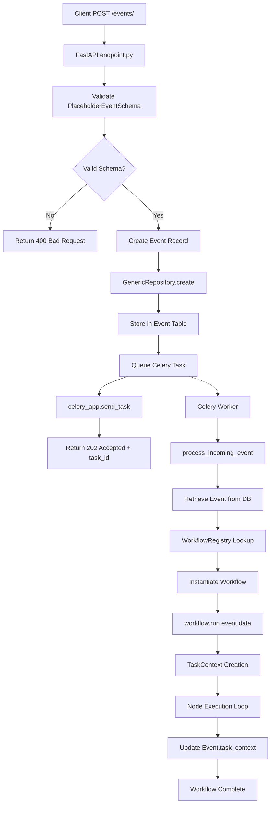
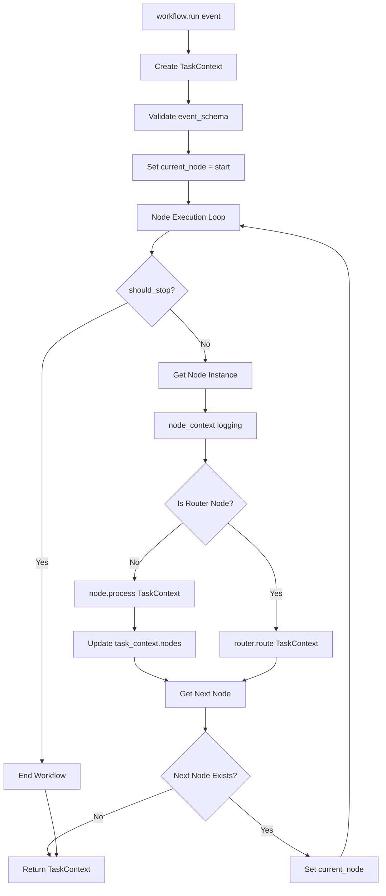
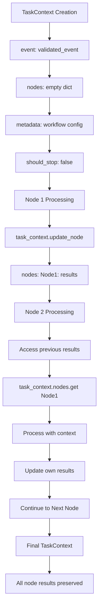
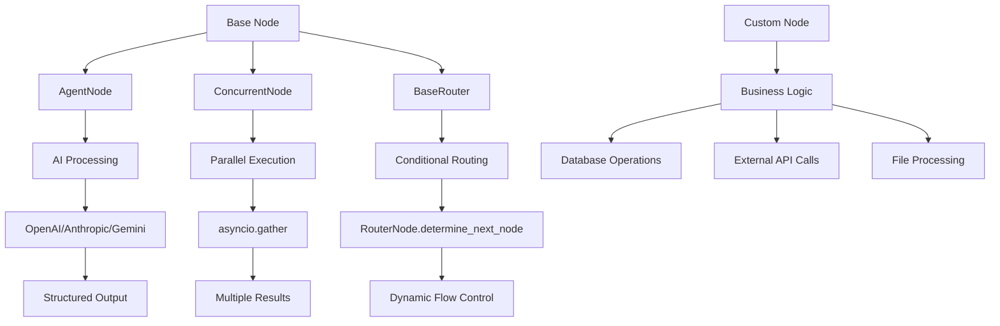
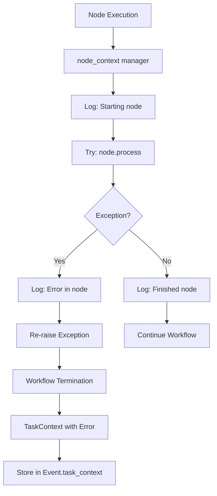

# GenAI Launchpad Workflow Visualization Template

This template provides the structure for documenting backend feature workflows using Mermaid diagrams, specifically for the GenAI Launchpad event-driven architecture.

## Overview
Brief description of the feature and its primary workflows using the GenAI Launchpad framework.

## GenAI Launchpad Event-Driven Architecture

### 1. Complete Event Processing Flow
Shows the full flow from API request to workflow completion.



### 2. GenAI Launchpad Workflow Execution
Shows how workflows execute through the DAG-based node system.



### 3. TaskContext State Management
Shows how state flows through workflow nodes.



### 4. Node Types and Patterns
Shows the different node types available in GenAI Launchpad.



### 5. Error Handling and Logging
Shows how errors are handled within the workflow framework.



## Workflow Implementation Patterns

### Event Schema Definition
```python
class FeatureEventSchema(BaseModel):
    user_input: str
    metadata: Dict[str, Any]
    priority: Optional[str] = "normal"
```

### Node Implementation Pattern
```python
class ProcessingNode(Node):
    async def process(self, task_context: TaskContext) -> TaskContext:
        # Access event data
        event_data = task_context.event
        
        # Access previous node results
        previous_result = task_context.nodes.get("PreviousNode", {})
        
        # Perform processing
        result = await self.do_processing(event_data, previous_result)
        
        # Store results
        task_context.update_node(self.node_name,
                               result=result,
                               timestamp=datetime.now())
        
        return task_context
```

### Workflow Definition Pattern
```python
class FeatureWorkflow(Workflow):
    workflow_schema = WorkflowSchema(
        description="Feature processing workflow",
        event_schema=FeatureEventSchema,
        start=ValidationNode,
        nodes=[
            NodeConfig(
                node=ValidationNode,
                connections=[ProcessingNode],
                description="Validate input data"
            ),
            NodeConfig(
                node=ProcessingNode,
                connections=[RouterNode],
                description="Process the data"
            ),
            NodeConfig(
                node=RouterNode,
                connections=[SuccessNode, ErrorNode],
                is_router=True,
                description="Route based on processing result"
            )
        ]
    )
```

## Key Architecture Decisions

1. **Accept-and-Delegate Pattern**: API immediately returns 202 Accepted, processing happens asynchronously
2. **Event Sourcing**: All events stored in Event table with complete audit trail
3. **DAG-based Workflows**: Chain of Responsibility pattern with type-safe node execution
4. **TaskContext State**: Immutable state container flowing through all nodes
5. **Workflow Registry**: Centralized workflow discovery and instantiation

## Performance Characteristics

- **API Response Time**: Immediate 202 Accepted (< 50ms)
- **Workflow Execution**: Asynchronous via Celery workers
- **Node Processing**: Sequential with optional concurrent execution
- **State Management**: In-memory TaskContext during execution
- **Result Storage**: Final TaskContext stored in Event.task_context JSON field

## Integration Points

- **Database**: Event table via GenericRepository pattern
- **Queue**: Redis-backed Celery for async processing
- **AI Providers**: Multi-provider support through pydantic-ai
- **External APIs**: Custom nodes for third-party integrations
- **Monitoring**: Structured logging throughout workflow execution

## Workflow Validation

The framework includes comprehensive validation:
- **DAG Structure**: Ensures no cycles in workflow definition
- **Node Reachability**: Validates all nodes are reachable from start
- **Connection Rules**: Enforces single connections except for router nodes
- **Schema Validation**: Type-safe event and output validation